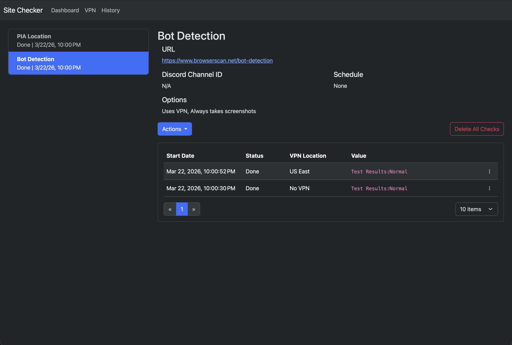
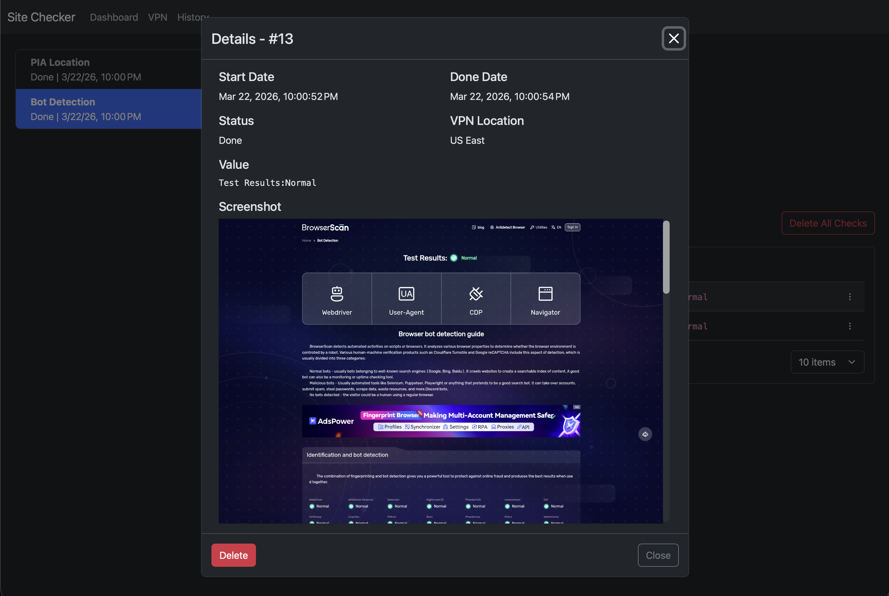

# Site Checker

Site Checker is a self-hostable web app that monitors websites for availability and content changes using headless browser automation, custom scraping logic, and VPN routing to bypass bot detection. It provides real-time notifications via Pushover and Discord, and a dashboard built with Angular utilizing SignalR for real-time updates.

I built this project because I wanted to know the moment a product I wanted to buy was back in stock (think during the great GPU shortage), a hotel room was available for a convention I wanted to attend that usually was booked in minutes, or a price dropped on something I wanted to buy (hopefully RAM pricing some day 🫠). I saw that similar applications already existed that tried to tackle this, but they weren't dynamic enough to be able to navigate through websites if the content I needed to check wasn't bookmark-able (such as handling hotel reservation dates, scrolling down pages and clicking links, etc.).

Bots and scapers have become a huge problem over the last few years, and I didn't want to add to that problem by building something that would constantly hammer websites with requests or automatically purchase items on my behalf. So instead, I built something that would only scrape websites every so often and would only notifiy me when something changed, and I would be the one to go and check the website and make the purchase manually. It helped me purchase computer components that I still use today and attend a future convention that I had been trying to get into for months, and I hope it can help you with similar use cases!

## Dashboard



## Details View



## Features

- **Automated Web Scraping** — Monitor websites for availability and content changes via Playwright browser automation
- **VPN-Routed Scraping** — Scrape location-specific content through Private Internet Access (PIA) VPN integration with automatic location rotation to reduce bot detection
- **Real-time Notifications** — Alerts via Pushover and Discord when changes are detected
- **Live Dashboard** — WebSocket-based real-time updates using SignalR
- **Observability** — OpenTelemetry integration for structured logging, tracing, and health monitoring

## Architecture

```
┌─────────────────────────────────────────────────────────┐
│                    Frontend (Angular 21)                │
│                  SPA for monitoring & management        │
└──────────────────────┬──────────────────────────────────┘
                       │ HTTP/SignalR
┌──────────────────────▼──────────────────────────────────┐
│              Backend (ASP.NET Core)                     │
│  API Server, Scraping Orchestration, VPN Management     │
└─┬────────────┬───────────────────────┬──────────────────┘
  │            │                       │
  ▼            ▼                       ▼
┌────────┐  ┌─────────────┐   ┌──────────────────────┐
│Database│  │  Notifiers  │   │   Browserless        │
│(SQLite)│  │Push/Discord │   │Standard & VPN-routed │
└────────┘  └─────────────┘   └──────────────────────┘
```

### Components

- **Backend** — ASP.NET Core API server with controllers, services, and VPN management
- **Database** — EF Core models, migrations, and services using SQLite
- **Frontend** — Angular 21 SPA for monitoring and managing site checks
- **Scraper** — Reusable Playwright-based scraping library
- **Notifiers** — Pushover and Discord notification implementations

## Prerequisites

- [.NET 10 SDK](https://dotnet.microsoft.com/download)
- [Node.js 24+](https://nodejs.org/) and npm
- [Docker](https://www.docker.com/) and Docker Compose
- [Private Internet Access VPN](https://www.privateinternetaccess.com/) account (for VPN features)

## Quick Start

### Using Docker (Recommended)

1. **Clone the repository**
   ```bash
   git clone https://github.com/chasepie/site-checker.git
   cd site-checker
   ```

2. **Configure environment variables**
   ```bash
   cp example.env .env
   # Edit .env with your configuration
   ```

3. **Start all services**
   ```bash
   docker compose up
   ```

4. **Access the application**
   - Application: http://localhost:8080
   - API docs: http://localhost:8080/scalar

### Local Development

Two VS Code launch configurations are available: **Launch App with Containers** (uses Browserless + VPN Docker containers) and **Launch App and Playwright** (fully local, no Docker required). Both will start the Angular dev server and open the app in Chrome automatically.

See [docs/local-development.md](docs/local-development.md) for full setup instructions, manual backend/frontend steps, and VPN container networking troubleshooting.

## Configuration

Configuration is managed through `appsettings.json`, `.env` files, and Docker environment variables. See [docs/configuration.md](docs/configuration.md) for the full environment variables reference and Docker services table.

## Development

### Creating a New Scraper

1. Create a class inheriting from `ScraperBase`:

```csharp
public class ExampleScraper(ILogger<ExampleScraper> logger)
    : ScraperBase(logger, ExampleScraper.ScraperId, ExampleScraper.DefaultUrl)
{
    public const string ScraperId = "example-scraper";
    public const string DefaultUrl = "https://example.com";

    protected override async Task<ScrapeResult> DoScrapeAsync(IPage page, ScrapeRequest request)
    {
        request.LogInfo(_logger, "Starting scrape");

        var locator = await page.WaitForFirstLocatorAsync([
            page.Locator("selector1"),
            page.Locator("selector2")
        ]);

        var text = await locator.TextContentAsync();

        return new ScrapeResult { IsSuccess = true, Content = text };
    }
}
```

2. Register it by calling `services.AddScraper<ExampleScraper>()` inside `AddScraperServices()` in `src/Scraper/ScraperService.cs`.

3. Add an entry in `DataSeeder.cs` to seed the initial site record.

## Technology Stack

### Backend
- .NET 10 / C# 14
- ASP.NET Core
- Entity Framework Core + SQLite
- OpenTelemetry

> The backend uses the C# 14 [extension members](https://learn.microsoft.com/en-us/dotnet/csharp/whats-new/csharp-14#extension-members) feature, which replaces the traditional `static class` extension method pattern with a first-class `extension` block syntax.

> Discord notifications use [NetCord](https://github.com/NetCord/NetCord), currently in pre-release (`1.0.0-alpha`). The library is stable in practice but the version number reflects its pre-1.0 API status.

### Frontend
- Angular 21
- TypeScript 5.9
- NgRx Signals + RxJS + SignalR Client
- Zod (runtime validation)
- AG Grid + ng-bootstrap

### Infrastructure
- Docker & Docker Compose
- Playwright + Browserless Chrome
- WireGuard VPN (PIA)

## Acknowledgments

- Browser automation by [Playwright](https://playwright.dev/)
- VPN integration via [thrnz/docker-wireguard-pia](https://github.com/thrnz/docker-wireguard-pia)
- Notifications via [Pushover](https://pushover.net/) and [Discord](https://discord.com/)
