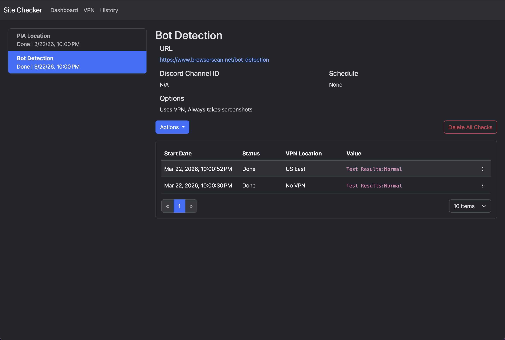
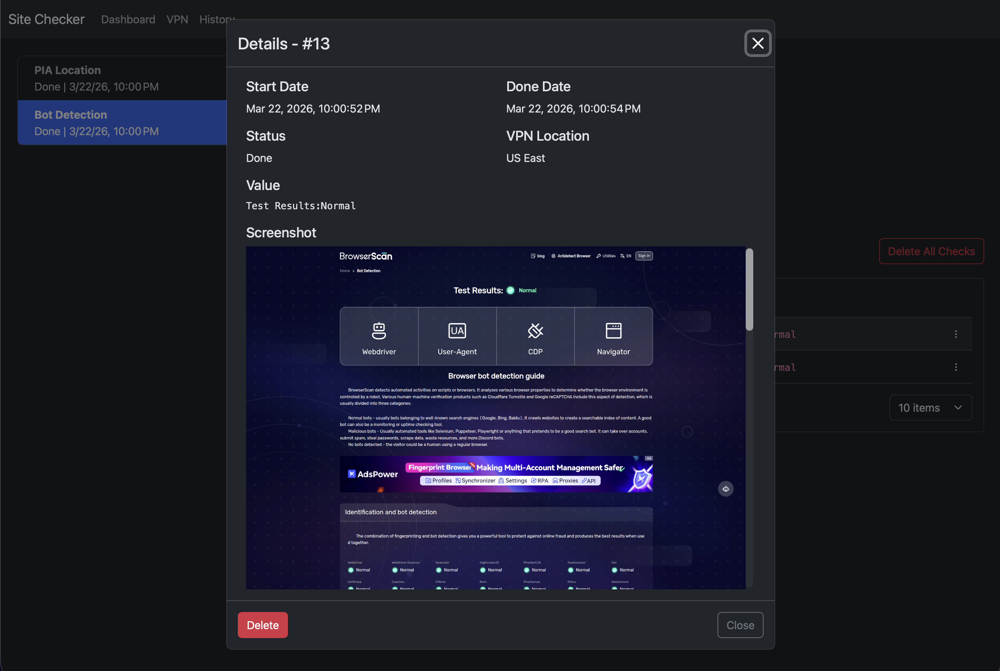

# Site Checker

Site Checker is a self-hostable web app that monitors websites for availability and content changes using headless browser automation, custom scraping logic, and VPN routing to bypass bot detection. It provides real-time notifications via Pushover and Discord, and a live dashboard built with Angular using SignalR for real-time updates.

I built it because I wanted to know the moment a product was back in stock, a hotel room opened up, or a price dropped, but existing apps/tools weren't dynamic enough to handle sites where the content I needed wasn't directly bookmarkable (think navigating to a specific date on a hotel search, scrolling through a page, clicking through to a product, etc.). Bots and scrapers have become a real problem over the last few years, so I deliberately kept this tool passive — it only checks at a set interval and notifies me of changes, leaving the actual purchase to me.

I've been able to use this tool to purchase a GPU during the 2020 chip shortage, snag hard-to-get hotel rooms for future conventions, and monitor price drops on products I want to buy (hopefully RAM prices some day 🫠). It's also been a fun opportunity to experiment with new technologies like Playwright, Angular Signals, and the latest C#/.NET features. Hopefully it's useful to others too!

**Dashboard**



**Details View**



## Features

- **Automated Web Scraping** — Monitor websites for availability and content changes via Playwright browser automation
- **Sites as Data** — Create, edit, test-run and delete Sites in the dashboard; each Site's scraping logic is an uploaded C# script, compiled at runtime, so adding one needs no rebuild or redeploy
- **Known Failures** — Scripts can recognise states like access denied or a blocked VPN Location, and ask for another VPN Location or a retry
- **VPN-Routed Scraping** — Scrape location-specific content through Private Internet Access (PIA) VPN integration with automatic location rotation to reduce bot detection
- **Real-time Notifications** — Alerts via Pushover and Discord when changes are detected
- **Live Dashboard** — WebSocket-based real-time updates using SignalR
- **Observability** — OpenTelemetry integration for structured logging, tracing, and health monitoring

## Architecture

```
┌─────────────────────────────────────────────────────────┐
│                    Frontend (Angular 21)                │
│                  SPA for monitoring & management        │
└──────────────────────┬──────────────────────────────────┘
                       │ HTTP/SignalR
┌──────────────────────▼──────────────────────────────────┐
│              Backend (ASP.NET Core)                     │
│  API Server, Scraping Orchestration, VPN Management     │
└─┬────────────┬───────────────────────┬──────────────────┘
  │            │                       │ HTTP
  ▼            ▼                       ▼
┌────────┐  ┌─────────────┐   ┌──────────────────────┐
│Database│  │  Notifiers  │   │    Scrape Worker     │
│(SQLite)│  │Push/Discord │   │  runs every script   │
└────────┘  └─────────────┘   └──────────┬───────────┘
                                         │ CDP
                              ┌──────────▼───────────┐
                              │     Browserless      │
                              │Standard & VPN-routed │
                              └──────────────────────┘
```

### Components

- **Backend** — ASP.NET Core API server with controllers, services, and VPN management
- **Database** — EF Core models, migrations, and services using SQLite
- **Frontend** — Angular 21 SPA for monitoring and managing site checks
- **Scraper** — The shared scrape pipeline (browser, navigation, timeout, screenshots) and the runtime script compiler
- **ScrapeWorker** — Runs the scrape pipeline, and so every uploaded script, in its own container, away from the app's secrets and database
- **Scripting** — `SiteChecker.Scripting`, the contract scripts compile against, published as a NuGet package
- **Notifiers** — Pushover and Discord notification implementations

## Quick Start

### Prerequisites

- [.NET 10 SDK](https://dotnet.microsoft.com/download)
- [Node.js 24+](https://nodejs.org/) and npm
- [Docker](https://www.docker.com/) and Docker Compose
- [Private Internet Access VPN](https://www.privateinternetaccess.com/) account (for VPN features)

### Using Docker (Recommended)

1. **Clone the repository**
   ```bash
   git clone https://github.com/chasepie/site-checker.git
   cd site-checker
   ```

2. **Configure environment variables**
   ```bash
   cp example.env .env
   # Edit .env with your configuration. ADMIN_PASSWORD, ALLOWED_HOSTS and SCRAPE_WORKER_SECRET are required.
   ```

   On Linux, also create the data directories for the app's non-root user (UID 1654), since Docker
   would create them owned by root, and set `DOCKER_GID` in `.env` to the Docker socket's group
   (`getent group docker | cut -d: -f3`). Docker Desktop needs neither.
   ```bash
   mkdir -p site-checker/data site-checker/logs site-checker/pia
   sudo chown -R 1654 site-checker/
   ```

3. **Start all services**
   ```bash
   docker compose up
   ```

4. **Access the application**
   - Application: http://localhost:8080
   - API docs: http://localhost:8080/scalar

### Local Development

Two VS Code launch configurations are available: **Launch App with Containers** (uses Browserless + VPN Docker containers) and **Launch App and Playwright** (fully local, no Docker required). Both will start the Angular dev server and open the app in Chrome automatically.

See [docs/local-development.md](docs/local-development.md) for full setup instructions, manual backend/frontend steps, and VPN container networking troubleshooting.

## Configuration

Configuration is managed through `appsettings.json`, `.env` files, and Docker environment variables. See [docs/configuration.md](docs/configuration.md) for the full environment variables reference and Docker services table.

## Development

### Adding a Site

Sites are created in the dashboard (**New Site**). Each Site has a URL and a script: a single C# file
with one class that implements `IScript`. The app navigates to the Site's URL, then runs the script on
the loaded page:

```csharp
public sealed class Example : IScript
{
    public async Task<ScriptOutcome> RunAsync(ScriptContext ctx)
    {
        if (ctx.Navigation.Response?.Status is 403 or 429)
        {
            return ScriptOutcome.KnownFailure("Blocked", RequestedAction.ChangeVpnLocation, RequestedAction.Retry);
        }
        ctx.Navigation.EnsureSucceeded();

        var price = await ctx.Page.Locator(".price").TextContentAsync();
        return price?.Trim() ?? "[no price]";
    }
}
```

Choose the `.cs` file in the Site editor, use **Run test** to try it against the live page, and save.
[samples/DemoScrapers](samples/DemoScrapers/README.md) has the full guide, the rules the runtime compiler
enforces, and how to set up an authoring project with the `SiteChecker.Scripting` package.

## Security

The app is behind a single-user login (`ADMIN_PASSWORD`). Uploaded scripts run unsandboxed, but in
the Scrape Worker container: it has no secrets but the Browserless token and its own secret, no
volumes, no Docker access and no route out except through the browsers. The app reaches Docker only
through a socket proxy that can do nothing but restart the VPN containers.

The login is one shared password, so keep the app on trusted networks (a home LAN, a private VPN like
Tailscale), and don't expose it to the internet without a reverse proxy that adds HTTPS and its own
login (list it in `TRUSTED_PROXIES`). See [docs/configuration.md](docs/configuration.md#trust-boundary).

## Technology Stack

### Backend
- .NET 10 / C# 14 (uses first-class [extension members](https://learn.microsoft.com/en-us/dotnet/csharp/whats-new/csharp-14#extension-members) over the traditional `static class` pattern)
- ASP.NET Core
- Entity Framework Core + SQLite
- OpenTelemetry
- [Reinforced.Typings](https://github.com/reinforced/Reinforced.Typings) — generates TypeScript interfaces and Zod schemas from C# models at build time
- [NetCord](https://github.com/NetCord/NetCord) for Discord notifications (pre-release `1.0.0-alpha`, stable in practice)

### Frontend
- Angular 21
- TypeScript 5.9
- NgRx Signals + RxJS + SignalR Client
- Zod (runtime validation)
- AG Grid + ng-bootstrap

### Infrastructure
- Docker & Docker Compose
- Playwright + Browserless Chrome
- WireGuard VPN (PIA)

## What's Next
- Add a no-code scraper builder — define CSS selectors, wait conditions, and interactions (clicks, scrolls) directly in the dashboard without writing a script for less complicated checks ([design 0002](docs/design/0002-steps-scrapers.md))
- Add support for prompt-based AI-powered web scraping using services like ChatGPT, Claude, or Ollama ([design 0003](docs/design/0003-prompt-scrapers.md))

## Acknowledgments

- Browser automation by [Playwright](https://playwright.dev/)
- VPN integration via [thrnz/docker-wireguard-pia](https://github.com/thrnz/docker-wireguard-pia)
- Notifications via [Pushover](https://pushover.net/) and [Discord](https://discord.com/)
