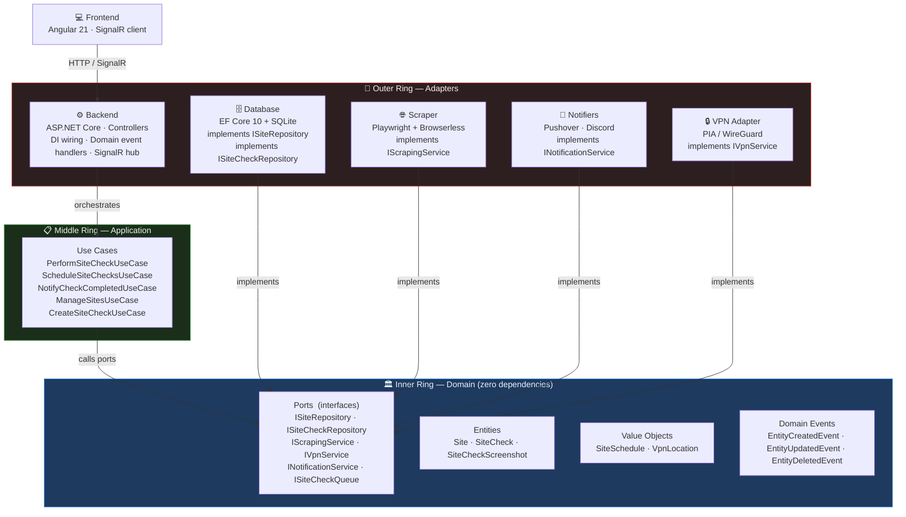

# Architecture Diagram

```mermaid
graph TD
  FE["💻 Frontend<br/>Angular 21 · SignalR client"]

  subgraph Outer["🔌 Outer Ring — Adapters"]
    BE["⚙️ Backend<br/>ASP.NET Core · Controllers<br/>DI wiring · Domain event handlers · SignalR hub"]
    DB["🗄️ Database<br/>EF Core 10 + SQLite<br/>implements ISiteRepository<br/>implements ISiteCheckRepository"]
    SC["🌐 Scraper<br/>Playwright + Browserless<br/>implements IScrapingService"]
    NT["🔔 Notifiers<br/>Pushover · Discord<br/>implements INotificationService"]
    VPN["🔒 VPN Adapter<br/>PIA / WireGuard<br/>implements IVpnService"]
  end

  subgraph Middle["📋 Middle Ring — Application"]
    UC["Use Cases<br/>PerformSiteCheckUseCase<br/>ScheduleSiteChecksUseCase<br/>NotifyCheckCompletedUseCase<br/>ManageSitesUseCase<br/>CreateSiteCheckUseCase"]
  end

  subgraph Inner["🏛️ Inner Ring — Domain  (zero dependencies)"]
    P["Ports  (interfaces)<br/>ISiteRepository · ISiteCheckRepository<br/>IScrapingService · IVpnService<br/>INotificationService · ISiteCheckQueue"]
    E["Entities<br/>Site · SiteCheck · SiteCheckScreenshot"]
    V["Value Objects<br/>SiteSchedule · VpnLocation"]
    DE["Domain Events<br/>EntityCreatedEvent · EntityUpdatedEvent · EntityDeletedEvent"]
  end

  FE -->|"HTTP / SignalR"| BE
  BE -->|"orchestrates"| UC
  UC -->|"calls ports"| P
  DB -->|"implements"| P
  SC -->|"implements"| P
  NT -->|"implements"| P
  VPN -->|"implements"| P

  style Inner fill:#1e3a5f,stroke:#4a9eff,color:#e8f4ff
  style Middle fill:#1a2e1a,stroke:#4caf50,color:#e8f5e9
  style Outer fill:#2d1f1f,stroke:#ef5350,color:#ffebee
```
