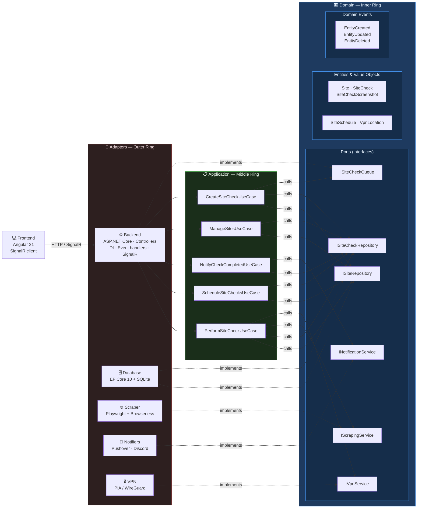

# Architecture Diagram

```mermaid
graph LR
  FE["💻 Frontend<br/>Angular 21<br/>SignalR client"]

  subgraph Outer["🔌 Adapters — Outer Ring"]
    direction TB
    BE["⚙️ Backend<br/>ASP.NET Core · Controllers<br/>DI · Event handlers · SignalR"]
    DB["🗄️ Database<br/>EF Core 10 + SQLite"]
    SC["🌐 Scraper<br/>Playwright + Browserless"]
    NT["🔔 Notifiers<br/>Pushover · Discord"]
    VPN["🔒 VPN<br/>PIA / WireGuard"]
  end

  subgraph Middle["📋 Application — Middle Ring"]
    direction TB
    UC1["PerformSiteCheckUseCase"]
    UC2["ScheduleSiteChecksUseCase"]
    UC3["NotifyCheckCompletedUseCase"]
    UC4["ManageSitesUseCase"]
    UC5["CreateSiteCheckUseCase"]
  end

  subgraph Inner["🏛️ Domain — Inner Ring"]
    direction TB
    subgraph Ports["Ports  (interfaces)"]
      direction LR
      ISR["ISiteRepository"]
      ISCR["ISiteCheckRepository"]
      ISS["IScrapingService"]
      INS["INotificationService"]
      IVS["IVpnService"]
      ISQ["ISiteCheckQueue"]
    end
    subgraph Model["Entities & Value Objects"]
      direction LR
      E["Site · SiteCheck<br/>SiteCheckScreenshot"]
      V["SiteSchedule · VpnLocation"]
    end
    subgraph Events["Domain Events"]
      direction LR
      DE["EntityCreated<br/>EntityUpdated<br/>EntityDeleted"]
    end
  end

  FE -->|"HTTP / SignalR"| BE

  BE --> UC1 & UC2 & UC3 & UC4 & UC5

  UC1 -->|"calls"| ISR & ISCR & ISS & IVS
  UC2 -->|"calls"| ISR & ISCR
  UC3 -->|"calls"| ISCR & INS
  UC4 -->|"calls"| ISR & ISCR
  UC5 -->|"calls"| ISR & ISCR & ISQ

  DB -.->|"implements"| ISR & ISCR
  SC -.->|"implements"| ISS
  NT -.->|"implements"| INS
  VPN -.->|"implements"| IVS
  BE -.->|"implements"| ISQ

  style Inner fill:#1e3a5f,stroke:#4a9eff,color:#e8f4ff
  style Middle fill:#1a2e1a,stroke:#4caf50,color:#e8f5e9
  style Outer fill:#2d1f1f,stroke:#ef5350,color:#ffebee
  style Ports fill:#152d4a,stroke:#4a9eff,color:#e8f4ff
  style Model fill:#152d4a,stroke:#4a9eff,color:#e8f4ff
  style Events fill:#152d4a,stroke:#4a9eff,color:#e8f4ff
```
